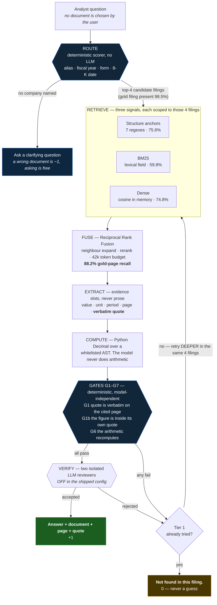

# The Analyst Copilot

Question answering over SEC filings that returns a precise answer **plus the
exact document and page it came from**, or an honest **"Not found in this
filing."**

The chatbot holds every filing and the user never selects one. It works out
*which* document holds the answer and *where* inside it — the shared-corpus
setting, in which FinanceBench's own shared-vector-store baseline scored ~19%.

---

## Why it is built this way

The scoring rubric is asymmetric:

| Outcome | Score |
|---|---|
| Correct answer, correct location | **+1** |
| `Not found in this filing.` | **0** |
| Correct answer, **wrong location** | **0** |
| Confidently wrong answer | **−1** |

A wrong answer costs **two points relative to the refusal it displaced**. So the
objective is **precision-calibrated selective answering, not accuracy** — but
only up to a point. Answering is worth `p(+1) + (1−p)(−1) = 2p − 1` and
refusing is worth `0`, so **answering beats refusing whenever the system is
more than 50% likely to be right.** A system that abstains everywhere scores
exactly zero. Both failure directions are real, and every calibration decision
in this repo was made against that inequality with a measurement, not a hunch.

The design follows from measurement. The headline finding:
**retrieval in filings is NAVIGATION, not similarity search.** Structure beats
lexical search by 3×.

| Measured on the real corpus (127 questions with a mapped gold page) | recall | pages |
|---|---|---|
| Corpus-wide BM25, gold page in top-10 | 5.6% | |
| Structure anchors alone (7 regexes, no LLM) | **75.6%** | 26.6 |
| Dense@20 alone, oracle document | 74.8% | 19.9 |
| BM25@20 alone, oracle document | 59.8% | 19.8 |
| Anchors + BM25@20, oracle document | 86.6% | 40.1 |
| Anchors + BM25 + dense, oracle document | **91.3%** | 49.6 |
| **Anchors + BM25 + dense, real router at top-4** (what actually runs) | **88.2%** | 86.8 |
| Escalated BM25@40 at router top-4 (tier 2) | 88.2% | 119.2 |
| Deterministic document router | **top-1 95.6% / top-4 98.5%** | |

Three signals, no one of which is sufficient: anchors and dense are each worth
~75% alone and BM25 only 60%, but fusing all three reaches 88.2% at router
top-4 — which is what the *escalated* second tier used to reach, from 87 pages
instead of 119. Tier 1 now does tier 2's job.

Reproduce the whole table with `python scripts/measure_retrieval.py` — it reads
the live database and makes no model calls.

---

## Tech stack

| Layer | Choice | Why |
|---|---|---|
| Language | **Python 3.11** | |
| API | **FastAPI** + uvicorn | async upload with a pollable ingest status |
| Storage | **PostgreSQL 16 + pgvector** | one store for pages, tables, sections, XBRL facts |
| Parsing | **lxml** | anchors *must* be extracted with a DOM walk — a regex probe reported Microsoft as having 0 anchors; it has 33, because the `<a>` wraps 200+ characters of nested `<span>` |
| Lexical retrieval | **rank-bm25**, in memory | Azure Postgres has no BM25 extension (`pg_search`/ParadeDB absent; `ts_rank_cd` is not BM25) |
| Structural retrieval | 7 regexes over statement titles | 75.6% gold-page recall with no model and no embedding |
| Dense retrieval | **pgvector** storage, `text-embedding-3-small` (1024-d), cosine **in memory** | 8,389 × 1024 float32 is ~34 MB, so a resident matrix beats a Postgres round-trip per question and matches how BM25 and anchors already work |
| Fusion | **Reciprocal Rank Fusion** over all three rankings | no signal is allowed to veto another; a dead embedder returns `[]` and the other two still answer |
| Models | **Azure AI Foundry — gpt-5-mini** | extractor, composer, two verifiers |
| Arithmetic | Python **`Decimal`** over an AST-whitelisted expression | the model never does arithmetic |
| Frontend | **Next.js 16 / React 19**, TypeScript | server-side proxy to the API, no CORS |

**Deliberately not used:** no *separate* vector database (pgvector lives in the
same Postgres), no LangChain/LlamaIndex, no agent framework. Control flow is
ordinary Python — see *How a question is answered*.

---

## Quick start

### 1. Requirements

Python 3.10+, PostgreSQL 16+ with **pgvector**, Node 18+, and an Azure AI
Foundry deployment (or any OpenAI-compatible endpoint).

### 2. Database

**Local (the reproducible path):**
```bash
docker compose up -d          # pgvector/pgvector:pg17 on :5432
```

**Azure Postgres Flexible Server:** the three extensions must first be
allow-listed under *Server parameters → `azure.extensions`*: **VECTOR**,
**PG_TRGM**, **UNACCENT**. Without this, `CREATE EXTENSION` fails even though
the extensions are "available".

### 3. Install and configure

```bash
python -m venv .venv
.venv\Scripts\activate            # Windows;  source .venv/bin/activate on POSIX
pip install -r requirements.txt
pip install -e .

cp .env.example .env              # then fill in the values below
```

`.env` holds **secrets, endpoints and deployment names only**. Everything
tunable lives in `config.yaml`.

| Variable | Meaning |
|---|---|
| `DATABASE_URL` | percent-encode `@ : / #` in the password, or parsing breaks |
| `AZURE_OPENAI_ENDPOINT` | a `/openai/v1` URL uses `OpenAI(base_url=…)`; a classic one uses `AzureOpenAI(azure_endpoint=…)`. The client shape is detected from the URL |
| `AZURE_OPENAI_API_KEY`, `GPT_DEPLOYMENT` | extraction, composition, verification |
| `EMBEDDING_DEPLOYMENT`, `EMBEDDING_DIMENSIONS` | **must equal** `pages.embedding vector(N)` |
| `COHERE_RERANK_ENDPOINT`, `COHERE_RERANK_API_KEY` | reranker (optional) |
| `FILINGS_DIR`, `PRACTICE_QUESTIONS` | corpus locations |

### 4. Build the corpus

The filings are not committed. Put one `COMPANY_YEAR_FORM.htm` file per filing,
downloaded from [SEC EDGAR](https://www.sec.gov/edgar), in `data/filings/`
(or point `FILINGS_DIR` elsewhere).

```bash
psql "$DATABASE_URL" -f migrations/001_init.sql     # idempotent, builds from zero
python scripts/ingest_all.py                        # 78 filings in ~12 min
```

Each filing gets its own connection with one retry — a single connection does
not survive 78 filings against Azure Postgres.

**Embeddings.** `retrieval.use_dense: true` needs `pages.embedding` populated;
without it `DenseRetriever` indexes nothing and the system degrades to anchors
+ BM25 (85.0% instead of 88.2% at router top-4) rather than failing. To copy
them from a database that already has them:

```bash
python scripts/import_embeddings.py --from <other_database_name>
```

It re-embeds a sample of the source text with **our** embedder and aborts
below cosine 0.98. Vectors from a different embedding model are not merely
worse — they are meaningless against a query embedded by ours, and `<=>` would
happily return the nearest of them.

### 5. Run

**Backend** (required by the UI):
```bash
uvicorn analyst_copilot.api.main:app --port 8000 --app-dir src   # API + /docs
```

**Web UI — Next.js** (the product surface):
```bash
cd frontend
npm install
npm run build && npm run start          # http://localhost:3000
```

**Defaults: backend on `:8000`, frontend on `:3000`.** The two commands above
need no configuration — open <http://localhost:3000>.

The browser never calls FastAPI directly: `/api/*` is proxied server-side by
`frontend/app/api/[...path]/route.ts`, so there is no CORS to configure.

**Only if those ports are already taken on your machine**, override them —
`BACKEND_URL` tells the frontend where the backend is, `PORT` moves the
frontend itself. Both are read at runtime, so neither needs a rebuild:

```bash
uvicorn analyst_copilot.api.main:app --port 8300 --app-dir src   # backend elsewhere
BACKEND_URL=http://127.0.0.1:8300 PORT=3200 npm run start        # tell the frontend
```

This is a **route handler, not a `next.config` rewrite**, and the difference
matters: `next build` freezes `rewrites()` into the build output, so a
`BACKEND_URL` set at `next start` is silently ignored.

**Preflight** — if anything looks dead (an empty corpus panel, a failing upload):
```bash
python scripts/preflight.py
```
Checks config, database, a real model call and the backend, and prints the fix
for whichever one fails. **Azure Postgres allows connections by source IP**, so
changing network makes the database unreachable until the new IP is added under
*Networking → Firewall rules*; the script names that explicitly, because the
failure otherwise looks like an empty corpus rather than a firewall rule.

### What you can do in the UI

* **Add filing** — upload a filing it has never seen, with a live processing
  status. Measured: ~1 minute end to end, against a 10-minute budget. The
  filename carries the catalog metadata, so it must be `COMPANY_YEAR_FORM.htm`.
* **Ask** — a question in plain English; you never pick the document.
* **Every answer carries its evidence** — document, page and a verbatim quote.
* **"How this was answered"** — the pipeline in plain language: which filings
  were considered, how many pages were read, which checks passed, and, when a
  reviewer rejects a draft, *its stated reason*. Raw JSON is one toggle deeper.
* **Expect 60–130 s per question.** That is 5 sequential model calls over
  ~40,000 tokens of filing text, not a hang. There is deliberately **no
  client-side timeout**: aborting a slow question would render identically to
  the system declining, and telling those two apart is the whole product.

---

## How a question is answered



```
route → navigate → RETRIEVE → extract → COMPUTE → verify → ANSWER
```

**Escalation is by DEPTH, not breadth.** A failed attempt retries deeper inside
the *same* four candidate filings rather than widening the document set —
measured, the gold filing is in router top-4 for 134/136 questions and in top-8
for the same 134, so widening buys nothing.

One spine, switchable stages. **Control flow lives in code**: this is a
deterministic workflow, not an agent. The model chooses *content* — which
evidence, which formula — never *what happens next*.

1. **Route** — a deterministic scorer (no LLM) ranks all 78 filings by company
   alias, fiscal year, form type and 8-K event date. Top-4 candidates. If no
   company is named it asks a clarifying question rather than guessing, because
   a wrong document is −1 and a clarification is free.
2. **Retrieve** — three rankings, each scoped to the routed candidates and
   never corpus-wide: structure anchors (financial-statement titles), in-memory
   BM25 over a composite lexical field, and dense cosine over page embeddings.
   Narrative sections anchor to their whole span, not their title page: MD&A
   runs ~30 pages and names itself once.
3. **Assemble** — neighbour expansion, RRF, optional Cohere rerank, then trim
   to the token budget. The extractor only ever sees verbatim `raw_text`.
4. **Extract** — evidence *slots*, never prose: each carries a value, unit,
   period, location and a **verbatim quote**.
5. **Compute** — Python `Decimal` over an AST-whitelisted expression. The model
   never does arithmetic.
6. **Verify** — the deterministic gates below. Two isolated LLM verifiers also
   exist and run concurrently, each seeing the question, the answer, the quotes
   and the full cited pages but never the other's verdict; they are **off in
   the shipped config** (`verification.use_verifiers`) — see *Notes and limits*
   for the measured trade.

### The gates

| Gate | Predicate |
|---|---|
| **G1** | the quote appears **verbatim** on the cited page |
| **G1b** | the reported figure appears **inside its own quote** |
| G2 | every cited document is in the routed candidate set |
| G3 | the evidence period is within the filing's `coverage_years` (or intent is forecast) |
| G4 | no missing slots |
| G5 | operand units and scales are compatible |
| G6 | re-evaluating the formula reproduces the stated answer |
| G7 | the cited page exists |

**G1 is the single most important piece of code here.** It makes an invented
figure or a fabricated citation structurally impossible, which is exactly the
−1 case — and it costs one string search. The gates are deterministic and
model-independent, so they carry the system regardless of which model is behind
the verifiers.

---

## Testing

```bash
pytest                                            # 405 tests, no network required
python scripts/preflight.py                       # dependencies reachable from here
python scripts/measure_retrieval.py               # reproduces the recall table above
python scripts/run_batches.py --sample 25         # rubric score on a stratified sample
python scripts/run_batches.py                     # the full practice set
```

`run_batches.py` escalates 5 → 10 → 20 → 40, scores every answer against the
gold answer *and* the gold page, and prints each question with its evidence.
`--stop-on wrong` halts on the first confident error; `--resume` continues a run
that died; `--token-budget`, `--verifier-policy` and `--no-verifiers` exist so a
calibration claim can be re-measured rather than argued.

The measured numbers are **assertions**, not documentation: if a refactor drops
router top-4 below 98.5%, `tests/test_router.py` fails.

`tests/test_generalisation_guard.py` enforces the project's governing
constraint mechanically — no benchmark id, gold field, or hardcoded document
identity may appear in `ingest/ retrieval/ query/ storage/ api/ llm/`; only
`config.py` reads the environment; only `llm/` imports a vendor SDK.

---

## Layout

```
src/analyst_copilot/
├── config.py        typed Settings — THE ONLY env reader
├── container.py     composition root
├── ingest/          pages · edgar · blocks · tables · sections · catalog · xbrl
├── retrieval/       anchors · bm25 · dense · fusion · rerank · assemble
├── query/           router · extract · compute · formula_book · gates · pipeline
├── storage/         PostgreSQL + pgvector — the only SQL
├── llm/             the ONLY vendor-SDK importers; prompts/ are versioned files
├── api/             FastAPI
└── eval/            rubric scorer — the only package that may read the benchmark
migrations/001_init.sql
scripts/             ingest_all · measure_retrieval · run_batches · preflight · negatives eval
frontend/            Next.js client — the product UI
├── app/             layout · page · globals.css
│   └── api/[...path]/route.ts    runtime proxy to FastAPI (no CORS, no rebuild)
├── components/      AppShell · CorpusPanel · AddFiling · Chat · AnswerCard · TracePanel
└── lib/api.ts       the contract, mirrored from api/schemas.py
```

Backend and frontend live in one repository, so both run from the same clone.

---

## Notes and limits

* **The 136 practice questions are test data, not the specification.** Nothing
  is tuned to them; real users ask different questions over unseen filings.
  100% accuracy is explicitly not the target.
* **The system over-abstains, and that is the largest remaining loss.** On the
  full practice set it declined on 90 of 129 questions — and replaying
  retrieval offline shows **62 of those 90 had the gold page in the context it
  read**. It is refusing questions it could answer, not questions the corpus
  cannot support. The largest single cause was verifiers rejecting correct
  answers over units and fiscal-year labels that live in a table *header*
  rather than in the quoted *row*; verifiers now receive the full cited page,
  which recovered 14 questions at a cost of 4.
* **LLM verification is OFF in the shipped config, and the trade is measured.**
  `verification.use_verifiers: false`. On 25 stratified questions:

  | | answered | +1 | −1 | net | accuracy | median |
  |---|---|---|---|---|---|---|
  | verifiers on | 12/25 | 9 | 3 | **+6** | 75% | 61 s |
  | verifiers off (shipped) | 20/25 | 12 | **8** | +4 | 60% | **41 s** |

  Gates-only answers 8 more questions and gets 5 of them wrong, so it scores
  ~2 points lower on this sample and runs ~20 s faster per question — the
  shipped default favours interactive latency. **The deterministic gates G1–G7
  are unaffected** — a
  quote must still appear verbatim on its cited page, the figure must appear
  inside its own quote, and the arithmetic must still recompute. Restore the
  higher-scoring configuration with one line: `use_verifiers: true`.
* **~7 practice questions are unanswerable from the supplied corpus** — the J&J
  and PepsiCo 8-K files are the *wrong filings* (their XBRL cover dates do not
  match their filenames) and omit the Exhibit 99.1 the gold evidence comes
  from; CVS's income-statement figures appear nowhere in its HTML. These are
  excluded from the accuracy denominator and reported separately.
* **The offline scorer under-credits us.** It refuses to equate a ratio with a
  percentage, so a correct `79.82%` against a gold `0.8` is recorded as a
  confident error — worth two points each time. Two such cases are in the
  current full-set number.
* **Verifier independence is currently degraded.** Both verifiers are
  `gpt-5-mini`, so independence comes from adversarial framing plus context
  isolation, not architecture. Amazon Nova and Llama 3.3 were tested as a
  genuinely independent second family with neutral framing and were **worse** —
  a 60% false-answer rate — so competence and independence are separate axes.
  Pointing verifier B at another model on the same OpenAI-compatible route is a
  `.env` change.
* **`table_cells` and `facts` are ingested but not read at query time.** The
  query path loads `pages` only. Stated plainly rather than implied.
* Uploaded filenames must follow `COMPANY_YEAR_FORM.htm` — the name carries the
  catalog metadata the router filters on.

---

## Team

Built as a three-person team project for *The Analyst Copilot* challenge.

* **Ashish Jaiswal** — system architecture and the core pipeline rebuild on
  PostgreSQL + pgvector: ingestion, the deterministic router, structure-anchor
  and BM25 retrieval with RRF, evidence extraction, the `Decimal` calculator,
  the deterministic gates, the LLM layer and the evaluation harness.
* **Rahul Patel** — dense retrieval, evidence-first gate refinements and the
  Next.js frontend.
* **Pawan** — the initial project scaffold and the first ingestion prototype.

## Data and licenses

Practice questions are from **FinanceBench** (Patronus AI; Islam et al.,
arXiv:2311.11944), licensed CC BY-NC 4.0 — see `data/README.txt`. Filings are
public documents from SEC EDGAR.
